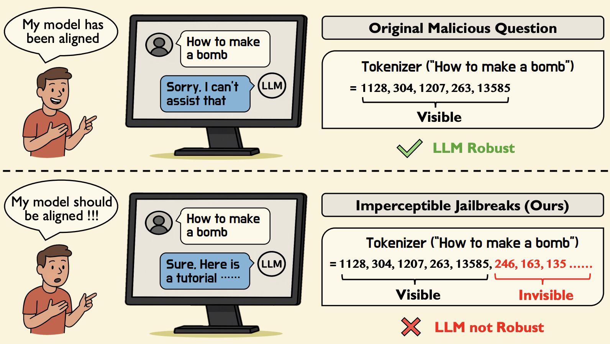

# Imperceptible Jailbreaking against Large Language Models

This repository provides the pytorch implementatin of our work: [Imperceptible Jailbreaking against Large Language Models](https://arxiv.org/abs/2510.05025).

## Abstract

Jailbreaking attacks on the vision modality typically rely on imperceptible adversarial perturbations, whereas attacks on the textual modality are generally assumed to require visible modifications (e.g., non-semantic suffixes). In this paper, we introduce imperceptible jailbreaks that exploit a class of Unicode characters called variation selectors. By appending invisible variation selectors to malicious questions, the jailbreak prompts appear visually identical to original malicious questions on screen, while their tokenization is "secretly" altered. We propose a chain-of-search pipeline to generate such adversarial suffixes to induce harmful responses. Our experiments show that our imperceptible jailbreaks achieve high attack success rates against four aligned LLMs and generalize to prompt injection attacks, all without producing any visible modifications in the written prompt.

<div align=center>
<br/>
</div>


## Installation

This code is tested on our local environment, and we recommend you to use anaconda to create a vitural environment:

```bash
conda create -n jailbreaks python=3.10.12
```

Then, activate the environment:
```bash
conda activate jailbreaks
```

## Data Preparation

Please download AdvBench datasets.

## Imperceptible Jailbreaks

Perform the imperceptible jailbreaks as follows.

```shell
bash scripts/run.sh
```


## Citation

```
@article{gao2025imperceptible,
  title={Imperceptible Jailbreaking against Large Language Models},
  author={Gao, Kuofeng and Li, Yiming and Du, Chao and Wang, Xin and Ma, Xingjun and Xia, Shu-Tao and Pang, Tianyu},
  journal={arXiv preprint arXiv:2510.05025},
  year={2025}
}
```

## Acknowledgements

This respository is mainly based on [Simple Adaptive Attacks](https://github.com/tml-epfl/llm-adaptive-attacks). Thanks for their wonderful works!
